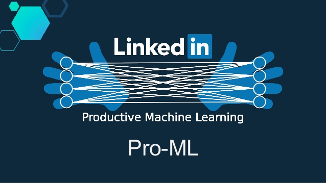

# Democratizing AI - Back-fitting End-to-end *Machine Learning* at *LinkedIn* Scale 
## [Joel Young](https://linkedin.com/in/joeldyoung) and [Bo Long](https://linkedin.com/in/bolonglinkedin)
## 27 September 2018

Just as software had taken over the world, artificial intelligence is taking over software. AI techniques are creeping in everywhere, even into the build systems. Also, increasingly engineers are learning machine learning as undergrads -- the days of lab-coated AI is coming to an end. In addition, in the past year or so, hardly a day goes by without new machine learning techniques and frameworks emerging. 

Since founding 15 years ago, LinkedIn has embraced AI -- from career recommendations to curating the feed. Each AI product was built by separate teams. Some of them are extremely performance sensitive (such as the Feed or Job Recommendations) with bespoke architectures. On-boarding new engineers, new features, and new modeling technologies. It is almost impossible for non-AI engineers to contribute. 

In this talk, we present "*Productive Machine Learning*" -- doubling modeler efficiency while democratizing AI across LinkedIn engineering. Our odyssey impacts thousands of engineers, hundreds of AI services, and several core learning technologies including tree ensembles, generalized additive mixture ensembles, and deep learning. We focus on four layers: Exploring and Authoring, Training, Deploying, and Running -- and the common threads that make it scale: Health Assessment and our Feature Marketplace. 

Key takeaway: Too often data science teams focus on just the machine learning and forget about the infrastructure and practices needed to actually serve AI at scale. 

## Resources
* [Strange Loop Link](https://www.thestrangeloop.com/2018/democratizing-ai---back-fitting-end-to-end-machine-learning-at-linkedin-scale.html)
* [Slideshare Link](https://www.slideshare.net/JoelYoung5/20180927-strange-loop-linkedin-democratizing-ai-at-linkedin)
* [PDF Slides](./pro-ml/20180927stangeloop-linkedin-pro-ml.pdf)
